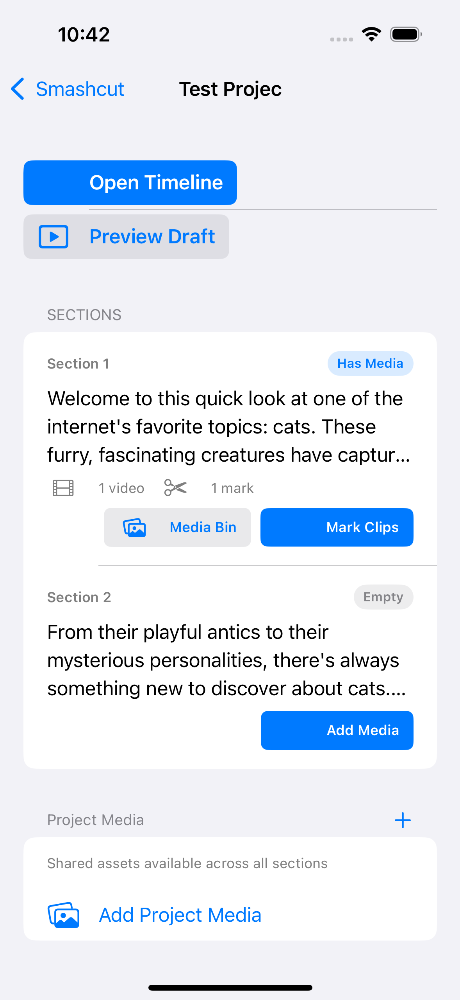
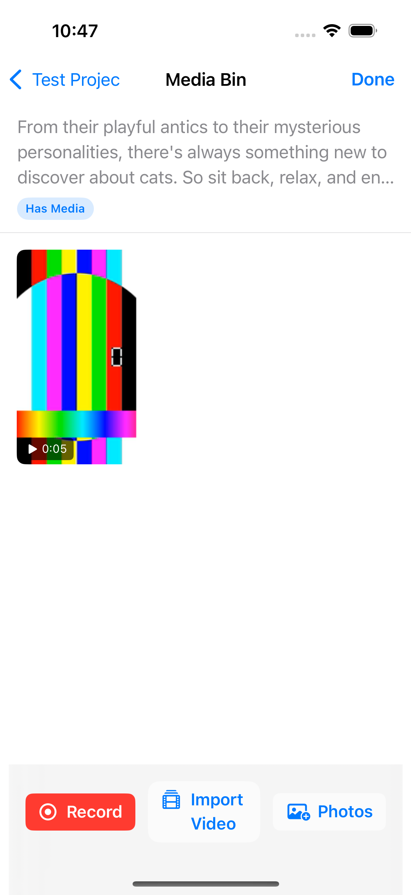
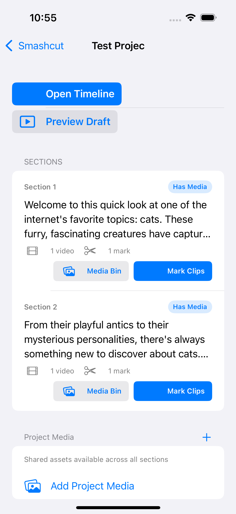
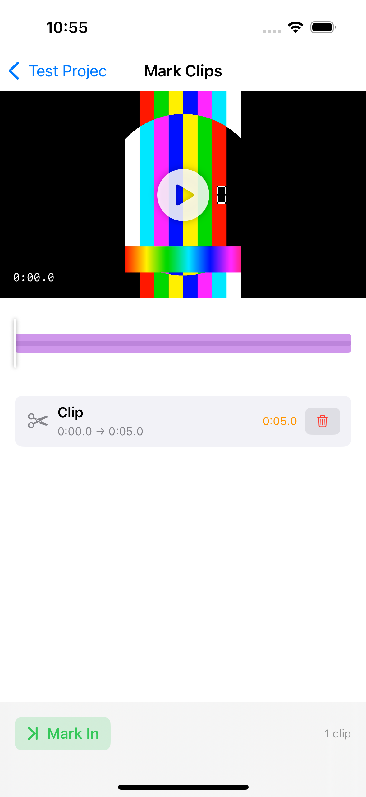
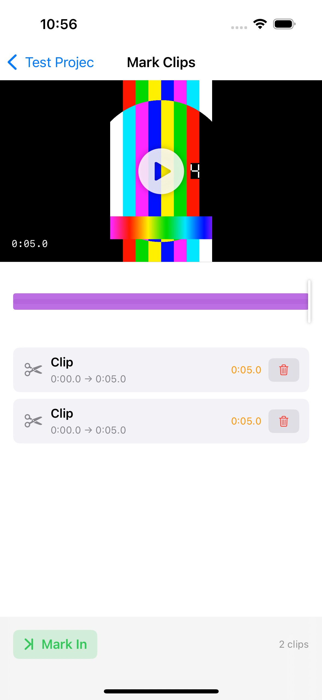
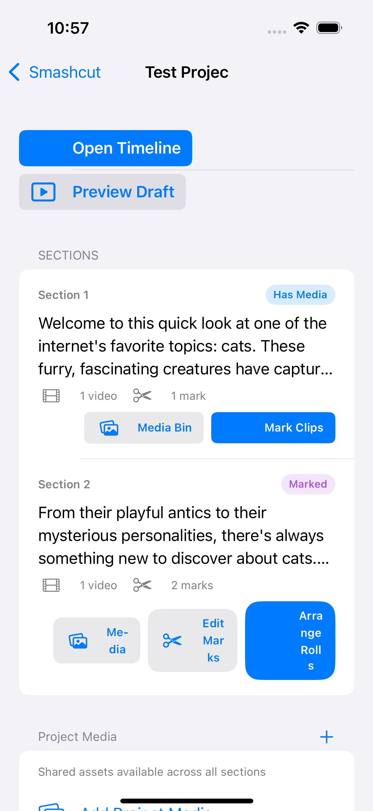
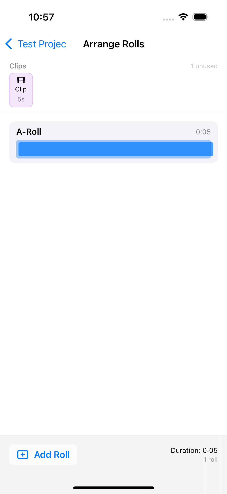

# Smashcut E2E Test Report — Section Editing Redesign

**Date:** 2026-03-16 22:57
**Device:** iPhone 16 (iOS 18.6 Simulator)
**Build:** `main` @ `4cd0744`
**Feature:** Section Editing Workflow Redesign (sm-qt8w)

## Summary

| Metric | Count |
|--------|-------|
| Flows tested | 5 |
| Passed | 4 |
| Known issues | 1 |
| Bugs found & fixed | 1 |

## Test Results

### 1. Section Manager — New SectionEditRowView
**Status: PASS**

Section manager shows new `SectionEditRowView` with:
- Progressive status badges: Empty → Has Media → Marked → Arranged
- Media counters (videos, marks)
- Status-aware action buttons that change per status

### 2. Media Bin — Import Video
**Status: PASS**

- Opened MediaBinView from "Add Media" button on empty Section 2
- Imported test video (5s color bar) from Photos picker
- Thumbnail generated correctly with duration badge "0:05"
- Status updated to "Has Media"
- Data persisted on back navigation (onDisappear auto-save)

### 3. Mark Editor — Multi-Mark Trim
**Status: PASS**

- Opened MarkEditorView from "Mark Clips" button
- Video preview shows actual video content (rainbow test pattern)
- Migration auto-created first clip (0:00 → 0:05)
- Successfully created second clip using Mark In / Mark Out workflow
- Timeline shows both marks as purple ranges
- Clip counter updated to "2 clips"
- Data persisted — section status progressed to "Marked"

### 4. Roll Arranger
**Status: PASS**

- Opened RollArrangerView from "Arrange Rolls" button
- A-Roll auto-created with correct 0:05 duration
- Blue timeline bar showing roll position
- Clips tray shows 1 unused clip available
- "Add Roll" button present for creating B-roll lanes

### 5. Legacy Video Playback (Section 1)
**Status: KNOWN ISSUE (pre-existing)**

- Section 1's video files are stale — absolute sandbox URLs broke when app was reinstalled
- Both new MarkEditorView AND legacy TimelineView show black/no video for Section 1
- This is a pre-existing issue with URL serialization, not introduced by redesign
- Section 2 (freshly imported) works correctly

## Bug Found & Fixed

### Toolbar Done button not firing (all new views)
- **Symptom:** Tapping "Done" in toolbar did nothing — no dismiss, no save
- **Root cause:** SwiftUI `ToolbarItem(placement: .confirmationAction)` buttons are unreliable in `navigationDestination` views
- **Fix:** Replaced toolbar Done with `onDisappear { save() }` auto-save pattern
- **Commit:** `4cd0744`

## Architecture Verification

| Check | Result |
|-------|--------|
| Build succeeds | Yes |
| 16 tests pass (0 failures) | Yes |
| Legacy views still work | Yes (SectionRowView, Timeline, etc.) |
| Migration creates SectionEdits | Yes (Section 1 migrated automatically) |
| Dual-write to legacy Script | Yes (Section 2 import updated both models) |
| Status progression | Empty → Has Media → Marked → (Arranged) |
| Data persistence | Yes (onDisappear save, verified across navigations) |
