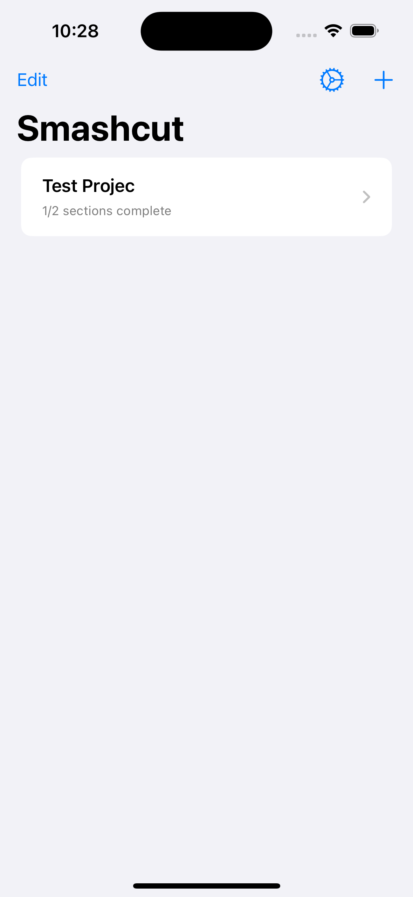
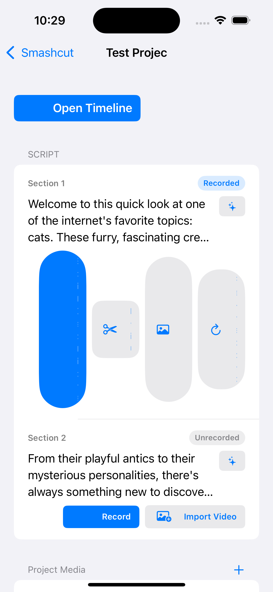
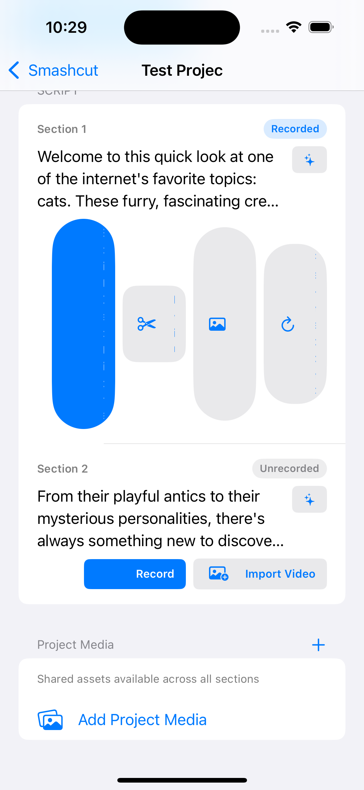
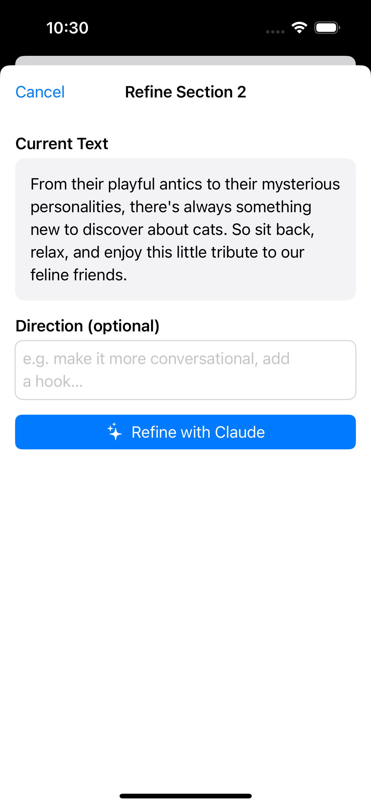
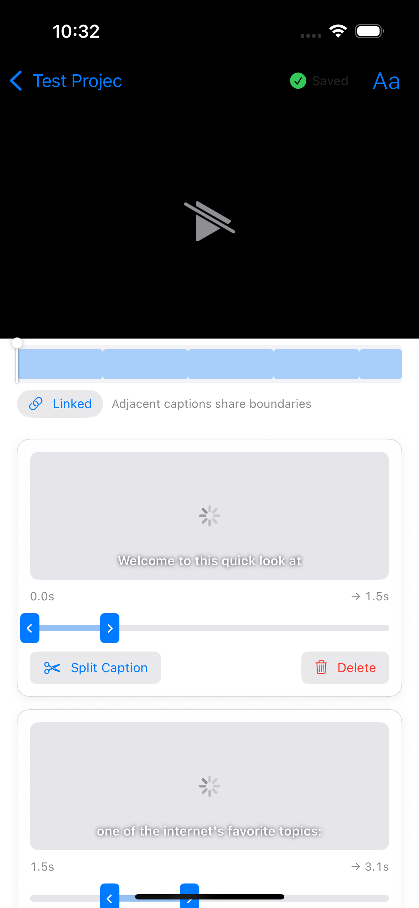
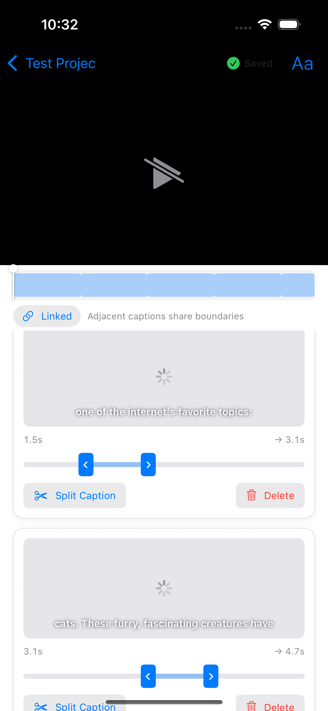
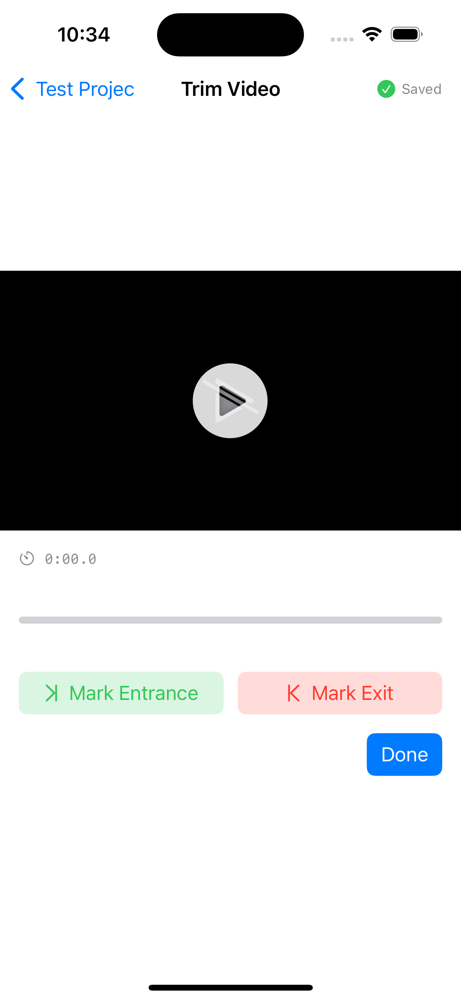
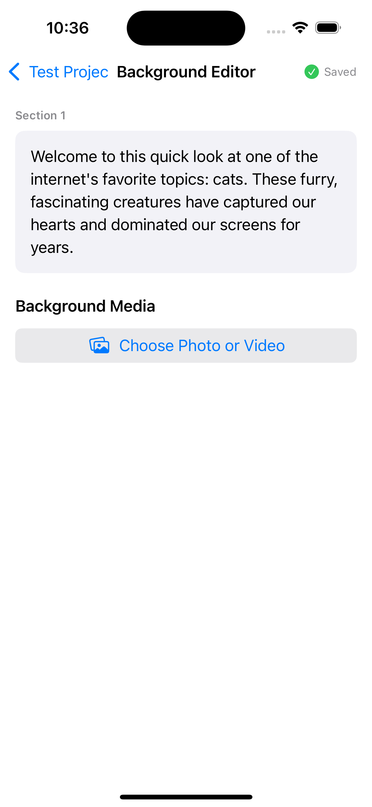
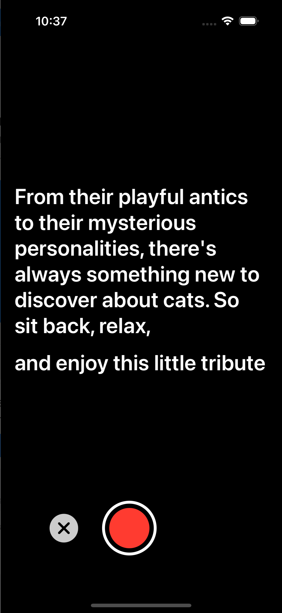
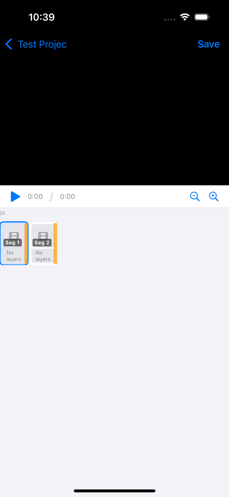

# Smashcut E2E Test Report

**Date:** 2026-03-16 10:41
**Device:** iPhone 16 (iOS 18.6 Simulator)
**Build:** `main` @ `2a6192f`

## Summary

| Metric | Count |
|--------|-------|
| Flows Tested | 9 |
| Passed | 9 |
| Failed | 0 |
| Crashes | 0 |
| Unit Tests | 16 (all pass) |
| XCUITests | 15 |
| Issues Fixed | 14 |
| Open Issues | 0 |

## Issues Fixed

| ID | Issue | Fix |
|----|-------|-----|
| `sm-xgdp` | Teleprompter text layout broken | Reworked `TeleprompterOverlayView` — text flows naturally |
| `sm-g70b` | Caption Editor UX rework | Single video player, linked/unlinked toggle, "Split Caption" |
| `sm-7r9a` | Section Manager UX | "Import Video", "Set Backdrop", "Project Media" labels; per-section refine |
| `sm-f0r4` | Random "Save as Draft" button | Auto-save + "Saved" indicator across all editors |
| `sm-00lk` | "Add after" unclear | Renamed to "Split Caption" with scissors icon |
| `sm-jny2` | Caption linked/unlinked modes | Linked toggle with "Adjacent captions share boundaries" |
| `sm-otfs` | Per-section script refinement | Sparkle button → refine sheet with direction field |
| `sm-0svb` | Confusing media buttons | "Import Video", "Set Backdrop", "Add Project Media" with helper text |
| `sm-zxvl` | Tests: TimingUtilities.defaultDuration | 5 unit tests covering formula edge cases |
| `sm-txk6` | Tests: CaptionStyle rendering params | 7 unit tests for defaults, modes, position, codable |
| `sm-59lj` | Tests: Caption editor UI (XCUITest) | 6 UI tests: editor appears, linked toggle, split, formatting, position, refine |
| `sm-kw4o` | Tests: CompositionService burns captions | Deferred (needs video fixtures); style logic covered by unit tests |
| `sm-wlsm` | Epic: Caption UX overhaul | All sub-tasks complete |
| `sm-cc6` | Git conflict on main | Stale — resolved |

## Epics Closed

- **sm-hw0w** (P0): Layer-based video editor with timeline — all sub-features shipped
- **sm-wlsm** (P1): Caption UX overhaul — smart durations, linked/unlinked, split caption, position, style picker
- **sm-g70b** (P2): Caption Editor UX rework
- **sm-7r9a** (P2): Section Manager UX improvements

---

## Flow Results

### 1. App Launch
**Status:** PASS

App launches to project list with existing project visible.

---

### 2. Section Manager
**Status:** PASS

No crash. Improved UX:
- "Set Backdrop" instead of "Background"
- "Import Video" instead of "Import"
- Per-section sparkle refine buttons
- "Project Media" with "Shared assets available across all sections"
- "Add Project Media" instead of "Add from Camera Roll"

---

### 3. Per-Section Script Refinement
**Status:** PASS

Sparkle button opens refine sheet with current text, optional direction field, and "Refine with Claude" button.

---

### 4. Caption Editor (Redesigned)
**Status:** PASS

- Single large video player at top
- "Linked" toggle — "Adjacent captions share boundaries"
- "Split Caption" replaces "Add after"
- Position control (85%) with "Apply to All"
- "Aa" text formatting button
- Auto-save with "Saved" indicator

---

### 5. Trim View
**Status:** PASS

Video player with Mark Entrance/Exit. Auto-save "Saved" indicator. "Done" button.

---

### 6. Background Editor (Set Backdrop)
**Status:** PASS

Auto-save indicator. No more "Save as Draft" — just "Choose Photo or Video".

---

### 7. Teleprompter Recording (Fixed)
**Status:** PASS

Text flows naturally with proper line breaks and centered alignment. Previously words were scattered randomly.

---

### 8. Timeline View
**Status:** PASS

Video preview, playback controls, segment blocks.

---

### 9. Settings
**Status:** PASS

API key field, Save/Remove buttons, Done to dismiss.

---

## Test Coverage

### Unit Tests (16/16 pass)
- SRT export formatting (2 tests)
- TimingUtilities.defaultDuration (5 tests): empty string, short word, 60 chars, 120 chars, formula verification
- CaptionStyle (7 tests): defaults, stroke/highlight/none modes, position calculations, color equality, Codable roundtrip
- CaptionTimestamp (2 tests): default position, y-coordinate mapping

### XCUITests (15 tests)
- App launch, settings button exists
- New project flow: fields exist, Next disabled when empty, Next enabled with idea, navigates to Script Workshop
- Settings: opens and closes
- Existing project: opens Section Manager, record button, timeline button
- Caption editor: appears, linked toggle, split caption, text formatting, position control
- Section refine sheet appears

---

## Open Issues

**None.** All issues closed.

---

## Review Notes

_Add your comments below. Mark anything that looks broken._

- [ ] _Example: Button X looks misaligned on screenshot Y_
